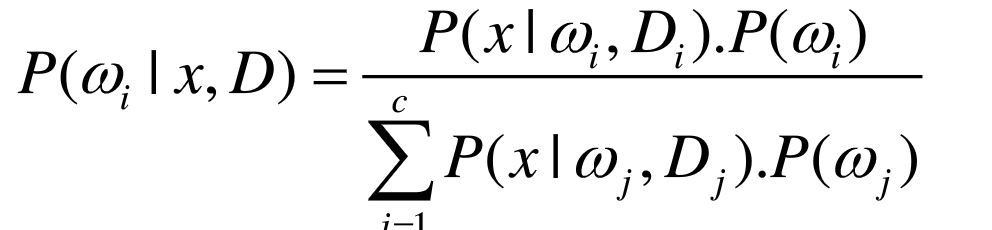

# difference between maxlikihood and bayesian methods

##Bayesian
通过先验分布，以及类密度条件来做。如果我们确定了一个模型，那么我们知道高斯分布的话有两个参数，然后我们就认为这两个参数是随机变量。

In order to calculate P(w_i|x), but P(x|w_i) is unknown.// P(x|w_i,D_i) is known?

Goal is P(w_i|x,D)，x is the data to be classified, D is data.

认为参数有一个先验概率分布，然后通过数据来计算参数的后验分布，然后求最大值点。

- P(x|w_i,D_i) = P(x|w_i,D)是因为w_i种类的数据的分布和其他类没有什么关系。
- P(w_i) = P(w_i|D)是因为种类的实际分布不会因为你的抽样数据产生影响。
- P(w_i)也就是种类的分布情况
- P(x|w_i,D_i)也就是在D_i数据集中，分析得出每个种类数据x的分布情况。

P(x|D)=积分p(x|Θ)p(Θ|D)dΘ
P(x,Θ|D)=

参数是随机变量，参数的分布模型已经知道P(Θ)（先验概率）。可以假设参数的分布是高斯分布。我们需要求参数的后验概率分布 P(Θ|D)

##max likelihood
主要是模型参数认为是定值，然后求得所观察数据产生的概率最大的情况。
