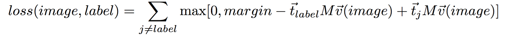
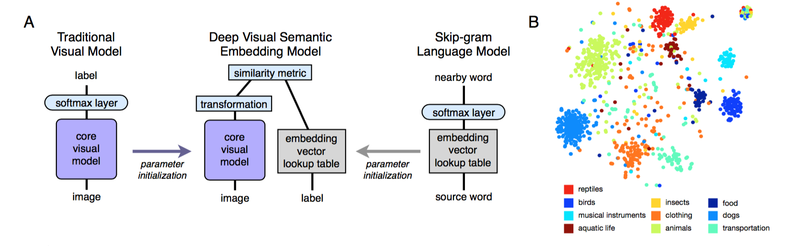

# DeViSE

[DeVise A Deep Visual-Semantic Embedding Model](pdf/41473.pdf)

Andrea Frome*, Greg S. Corrado*, Jonathon Shlens*, Samy Bengio Jeffrey Dean, Marc’Aurelio Ranzato, Tomas Mikolov

##Task(zero-shot learning)
随着分类种类的增多，已标记的训练数据就不够了，所以利用其他类型的数据。使用visual data但是限制他们的预测。

文中提出一个新的 deep visual-semantic embedding model 来 identify visual objects using both labeled image data as well as semantic information gleaned from unannotated text(使用labeled image data识别视觉物体,也用未分配的语义信息，注意这里的语义信息是直接unannotated的)

N way分类会有一些问题，主要是他们之间本来互相有联系,但是却强行把他们分成了互不关联的东西（artifical label）（**不过我认为这并不一定**），也就不能transfer语义信息。

DeViSE利用textual data来学习labels之间的语义关联，之后更明确地maps images into a rich semantic embedding space.结果正确率与1-N的分类器相当，但是减少了一些语义冲突或者说是错误。另外model利用了visual and semantic 相似性来正确预测了 object category labels for unseen categories，比如zero-shot classification

##Zero-shot
Zero shot learning in simple terms is a form of extending supervised learning to a setting of solving for example a **classification problem when not enough labeled examples are available for all classes**.

Imagine this very interesting problem cited here [1] where we look at creating a classifier for certain held out classes **(say for CIFAR 100 you could hold 80 classes as train and 20 classes as test).** There is no intersection between the classes in train and test. 

Typical practises include training on a **unlabeled corpora like word2vec on Wikipedia** to **get word representation** and learning a regression function between image features (CNN,SIFT features) and **dimensions of word2vec** and this is then applied to the test classes. 

##Model
###Language model pre-training
- The** skip-gram text modeling **architecture introduced by Mikolov et al 
  
    efficiently learn semantically-meaningful floating point representations of terms from unannotated text.
    这个模型学习表示每个term为固定长度的embedding vector，通过预测在文档中邻接的terms。
    
    具体原理：
    同义词更倾向于出现在相似的上下文中，这个简单的目标函数驱使着这个model为语义相似的单词学习相同的embedding vectors
    
- Training    
    
   We trained a skip-gram text model on a corpus of 5.7 million documents (5.4 billion words) extracted from wikipedia.org. 

   Our skip-gram model used a hierarchical softmax layer for predicting adjacent terms and was trained using a 20-word window with a single pass through the corpus. For more details and a pointer to open-source code, see [13].

The embedding vectors learned by the language model are **unit normed** and used to map label terms into target vector representations.

### Visual Model Pre-training
IMAGENET WINNING MODEL

### Deep Visual-Semantic Embedding Model
视觉模型的softmax layer去掉了，训练来预测每个图片的那个feature vector，再用a projection layer （linear 4096->500/1000）and a similarity metric来进行。

- loss function:
  
  We used a combination of dot-product similarity and hinge rank loss (similar to [20]) 
  produce a higher dot-product similarity between the visual model output and the vector representation of the correct label than between the visual output and **other randomly chosen text terms**.
  
  
  
  - 其中的训练trick:
    
    随机化
    - (1) restricting the set of false text terms to possible image labels，只用可能的image label的embedding vector进行训练
    - (2) truncating the sum after the first margin-violating false term was encountered. The ⃗t vectors were constrained to be unit norm, and a fixed margin of 0.1 was used in all experiments3
      - 不明白。。。

##Model Detail

##Previous Model
###WSABIE
这个模型处理image feature和label到一个空间中

only explored linear mappings from image features to the embedding space, and the available labels were only those provided in the image training set. It could thus not generalize to new classes.

###Socher el al(zero shot learning)
种类太少，模型不同
