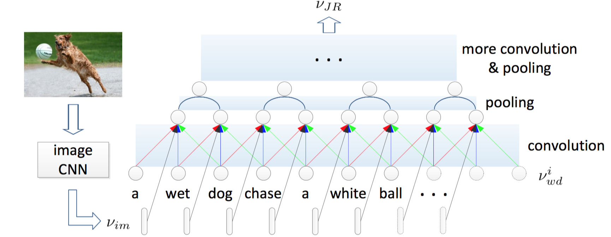
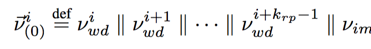

####Multimodal Convolutional Neural Networks for Matching Image and Sentence

#Task
句子->图像 以及 图像->句子 双向检索 on the Flickr8K and Flickr30K datasets.

#Model

* one image CNN encoding the **image content** 

* one matching CNN modeling **the joint representation of image and sentence**.

  * The matching CNN composes **different semantic fragments** from words and learns the inter-modal relations between image and the composed fragments at different levels => to fully exploit the matching relations between image and sentence. 
  
  * letting **image** and **the composed fragments of the sentence** meet and interact at different levels. (**使图像和句子的组合片段，在不同的level交互**)

  * local与global结合，在不同的level，单词、句子和图片会有所对应

#Model Detail (m-CNN的组成)
####Image CNN

generate the **image representation** (a 4096-dimensional feature vector)

then use W_im? => a **d-dimension vector ν_im**.

####Matching CNN
input: the encoded image representation **V_im** and word representations **V_wd**

produces: the joint representation **ν_JR** (learnt **joint representation** of image and sentence）

过程是matching CNNs first compose different semantic fragments from the words and then learn the intermodal structures and interactions between the image and composed fragments.

* #####word level matcing CNN: MatchCNN_wd

  

  这个结构非常特殊，因为我们注意到，对于文字的处理也是用CNN的，3个单词进行卷积，同时每个位置的卷积都把v_im加入
  
  
  K_rp 通常是为3
  
  限制最大长度，少的补0
  
  通过这样一个multimodal卷积，可以捕捉到word片段和图像vector之间的联系。

* #####phrase level matcing CNN: MatchCNN_phs(hort),phl(ong)
  简单地来说就是先对文字（句子）conv-pool，得到的roughly phrase level的数据(composed representation)，这些数据更多地包含物体与物体之间的关系，然后进行与V_im进行交互，再得到结果。
 
* #####sentence level matcing CNN: MatchCNN_st

####Multilayerperceptron(MLP) 
ν_JR (joint representation) => final matching score between image and sentence

